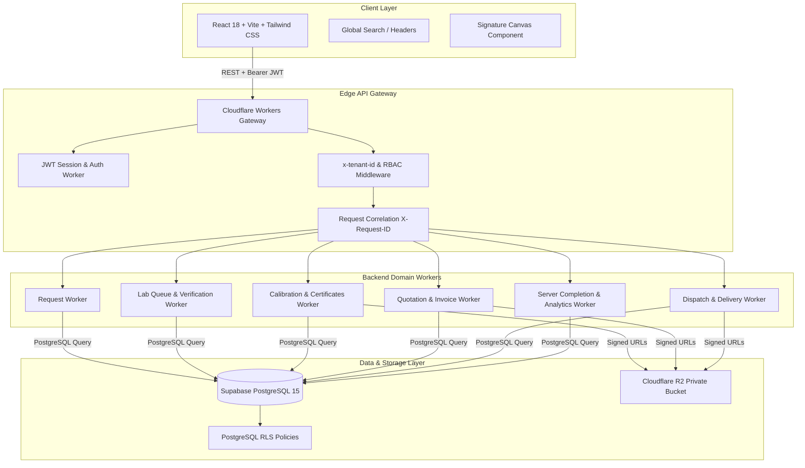

# Calibration Commercial Module (CCM) — Production Enterprise Application

An enterprise-grade, multi-tenant commercial metrology and calibration platform built with strict tenant data isolation, PostgreSQL Row-Level Security (RLS), Cloudflare Workers Edge API Gateway, private Cloudflare R2 object storage, digital canvas signatures, server-side workflow completion engine, operations hub, and an executive React + Vite + Tailwind CSS dashboard.

---

## 1. System Architecture



---

## 2. Technology Stack

- **Frontend UI**: React 18, Vite, TypeScript, Tailwind CSS, Lucide Icons, Canvas SignaturePad.
- **API Gateway & Edge**: Cloudflare Workers, Hono, REST API Gateway, Domain Workers.
- **Database Backend**: PostgreSQL 15, Supabase, Row-Level Security (RLS), Triggers, Functions.
- **Storage**: Cloudflare R2 Private Storage with isolated multi-tenant object paths & signed URLs.
- **Security & Validation**: Zod runtime schemas, JWT authentication, RBAC permission matrix, audit trail logging.

---

## 3. Complete 16-Stage Workflow Pipeline

1. **Tenant & Organization Setup**: Root tenant context (`tenant_id`) with linked organizations and sub-organizations (labs).
2. **Master Data Management**: Client Master (`clients`), Vendor Master (`vendors`), and Instrument Inventory (`item_masters`).
3. **Calibration Request Intake**: Collection agent intake, quantity checks, and mandatory availability overrides (`request.override_availability`).
4. **Lab Queue & Assignment**: Requests transferred to `LAB_QUEUE` and assigned to lead technicians (`lab_request_assignments`).
5. **Item Verification**: Visual inspection, discrepancy flags, and mandatory document uploads (`item_verifications`, `documents`).
6. **Calibration Operations**: Environmental logging, measurement point testing, PASS/FAIL result, certificate generation, and `next_due_date` calculation.
7. **Faulty Service & Repair Flow**: Failed calibration initiates `service_requests`. Client approval is captured, repairs performed, and item re-calibrated.
8. **Vendor Outsourcing Flow**: External vendor assignment (`vendor_outsourcings`), Purchase Orders (`vendor_pos`), shipment, return, and reintegration.
9. **Commercial Quotations**: Cost aggregation into commercial quotes (`quotations`), margin calculation, internal and client approval.
10. **Tax Invoicing**: Tax invoice issuance (`invoices`) with itemized pricing, CGST/SGST/IGST breakdown in Indian Rupees (INR / ₹), and partial/urgent handling.
11. **Client Digital Invoice Signature**: Public-safe secure client portal canvas signature drawing (`signature_type = 'INVOICE'`).
12. **Dispatch & Tracking**: Packing dispatch creation (`dispatches`), package barcode assignment, carrier selection, and tracking numbers.
13. **Client Delivery Confirmation**: Handheld client delivery receipt confirmation and signature (`signature_type = 'DELIVERY'`).
14. **Completion Engine**: Server-side `evaluateRequestCompletion` checks item stages and transitions request status to `COMPLETED` or `PARTIALLY_COMPLETED`.
15. **Operations Action Center**: Live monitoring of bottleneck exceptions, faulty items, unsigned invoices, and overdue calibrations.
16. **Security Audit & Reporting**: Immutable audit logs viewer, global search across reference numbers, and executive CSV reports.

---

## 4. Documentation Index

The repository includes a complete production documentation suite in `docs/`:

- [Database & RLS Architecture](docs/database.md) — Database schema, entity relationships, RLS policies, and performance indexes.
- [REST API Reference](docs/api.md) — Comprehensive API gateway endpoints, headers, payloads, and response formats.
- [Workflow Architecture](docs/workflow.md) — Step-by-step workflow state transitions and exception flow diagrams.
- [Security Architecture](docs/security.md) — JWT auth, RBAC permissions, multi-tenant RLS guarantees, signed URLs, and audit logging.
- [Production Deployment Guide](docs/deployment.md) — Deployment guide for Cloudflare Workers, Supabase PostgreSQL, R2 storage, and React Vite.
- [Final QA & Compliance Report](docs/final-qa.md) — QA sign-off report, test matrices, and build verification.

---

## 5. Local Setup & Execution

### Prerequisites
- Node.js v18+ (tested on Node v24)
- npm v9+

### Frontend Dashboard
```bash
cd frontend
npm install
npm run dev
```
Access dashboard at `http://localhost:3000`.

### Backend API Gateway
```bash
cd backend
npm install
npm run dev
```
Access API Gateway at `http://localhost:8787/api/v1`.

### Production Build & Type Checking
```bash
cd frontend
npm run build
```
Executes `tsc && vite build`. Builds cleanly with 0 compilation errors.

---

## 6. License & Security Notice

Property of Calibration Commercial Module (CCM). All rights reserved. Encrypted JWT credentials, Supabase keys, and Cloudflare R2 secrets must be managed via Cloudflare Secrets and `.env` files (see `.env.example`).
