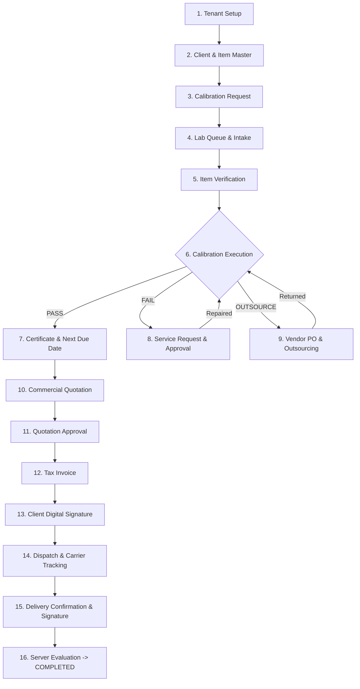

# Calibration Commercial Module (CCM) — Workflow Architecture

## Executive Workflow Summary

The **Calibration Commercial Module (CCM)** implements a 16-stage end-to-end commercial metrology workflow. Every request transitions through strict, server-side validated state transitions.

---

## Detailed Stage Breakdown

### Stage 1: Tenant & Hierarchy Setup
- Root tenant context (`tenant_id`) is provisioned with linked organizations and sub-organizations (labs/facilities).

### Stage 2: Master Data Management
- Client records (`clients`), vendor records (`vendors`), and instrument item inventory (`item_masters`) are registered.

### Stage 3: Request Registration & Availability Check
- Collection agent registers a calibration request (`calibration_requests`), selects items, and records availability (`YES` / `NO`).
- If an item is unavailable, explicit override permissions (`request.override_availability`) are enforced.

### Stage 4: Lab Queue Intake & Assignment
- Request is transferred to `LAB_QUEUE`. Lab manager accepts request and assigns a technician (`lab_request_assignments`).

### Stage 5: Verification & Mandatory Documents
- Technician conducts physical intake inspection (`item_verifications`). Required certificates/manuals (`documents`) are uploaded to private Cloudflare R2 storage.

### Stage 6: Calibration & Certificate Generation
- Technician records environmental conditions and measurement readings (`calibration_measurements`).
- On `PASS`, system issues calibration certificate (`calibration_certificates`) and sets `next_due_date`.

### Stage 7: Exception Paths (Faulty Service / Outsourcing)
- **Faulty Flow**: On `FAIL`, system creates `service_requests`. Client approval is captured, repairs executed, and item returned for re-calibration.
- **Outsource Flow**: Item assigned to vendor (`vendor_outsourcings`). Purchase order issued (`vendor_pos`), shipped to vendor, calibrated, returned, and reintegrated.

### Stage 8: Commercial Processing (Quotation & Invoice)
- System aggregates calibrated items into a quotation (`quotations`). Client approves quote.
- Tax invoice issued (`invoices`) with itemized pricing, CGST/SGST/IGST tax breakdowns in Indian Rupees (INR / ₹).

### Stage 9: Invoice Client Digital Signature
- Client accesses secure signing portal and draws signature on canvas (`invoice_signatures` with `signature_type = 'INVOICE'`).

### Stage 10: Dispatch & Carrier Shipment
- Logistics packs eligible items (`dispatches` with `STANDARD`, `PARTIAL`, or `URGENT` type) and records carrier name and tracking number (`IN_TRANSIT`, `OUT_FOR_DELIVERY`).

### Stage 11: Client Delivery Confirmation & Completion Engine
- Handheld client delivery confirmation records recipient name and delivery signature (`signature_type = 'DELIVERY'`).
- `evaluateRequestCompletion` runs server-side to inspect all items. Parent request transitions to `COMPLETED` when all items are delivered, or `PARTIALLY_COMPLETED` if partial items remain.
